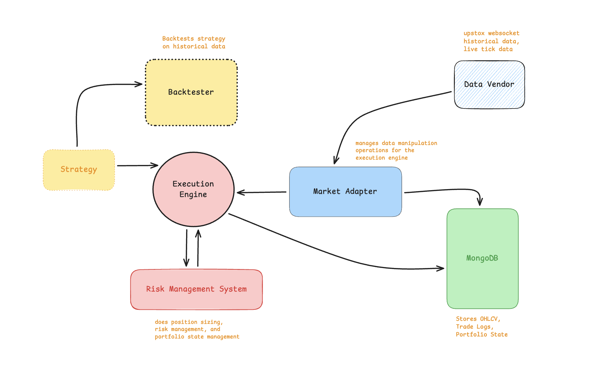
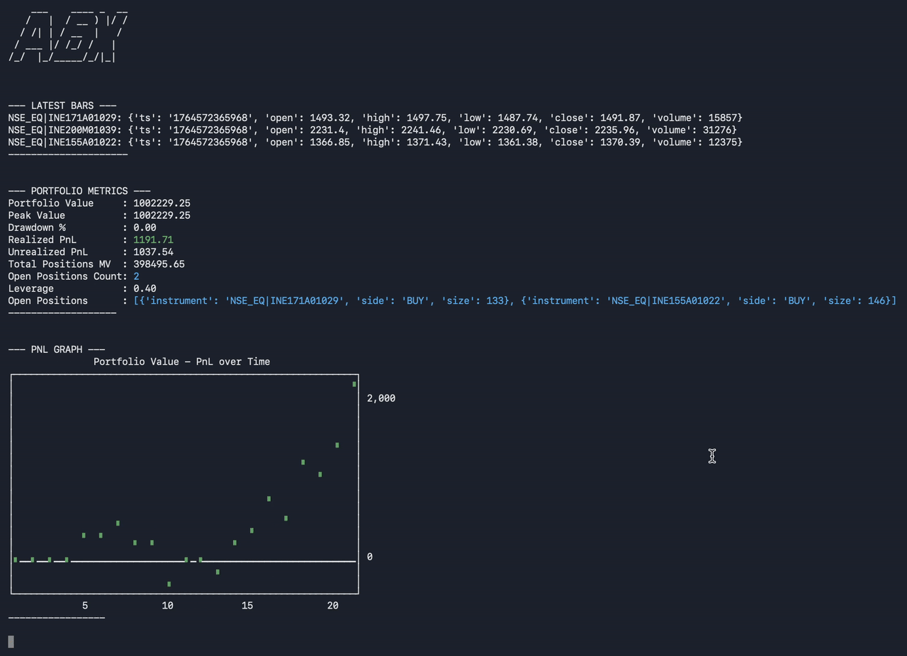

# BLIP - Backtest, Live, and Plot

A collection of tools and scripts for developing, backtesting, and deploying algorithmic trading strategies.

## Architecture

## Trader

## Project Structure

The repository is organized into the following main directories:

-   **/backtest**: Contains the backtesting engine and various strategy implementations. Use this to test the historical performance of trading ideas.
-   **/notebooks**: Houses Jupyter notebooks for research, data analysis, and exploratory work on trading models.
-   **/trader**: Includes the components for live trading execution, such as market adapters, risk management, and trading scripts.
-   **/utils**: A collection of utility scripts for tasks like fetching historical data, managing API access, and other supporting functions.

Each directory has its own `README.md` with more specific details.